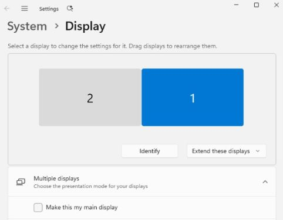
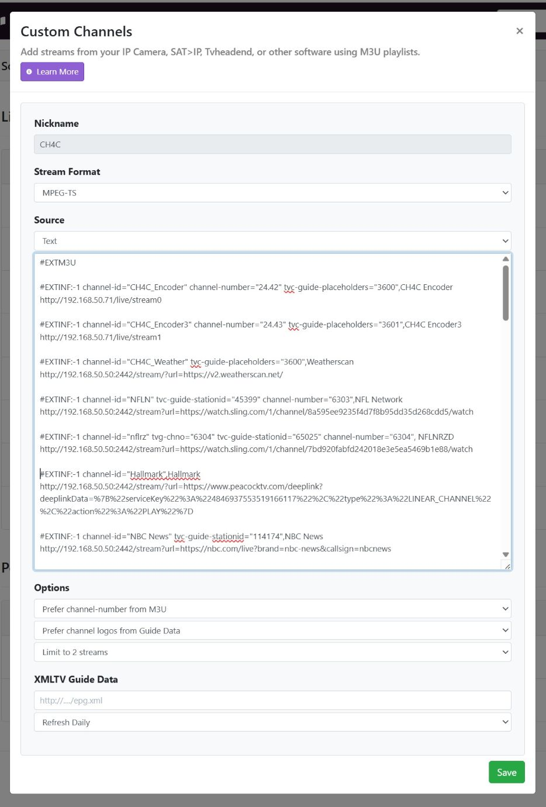

# Advanced Configuration

CH4C can also be configured via command-line parameters or a JSON configuration file. These methods are useful for automated deployments or scripted setups. If multiple configuration sources exist, the priority order is: command-line parameters > config.json > Settings UI.

## Command-Line Parameters

```
Usage: node main.js [options]

Options:
  -s, --channels-url              Channels server URL                    [string]
  -e, --encoder                   Encoder config (see format below)      [array]
  -p, --channels-port             Channels server port                   [default: "8089"]
  -c, --ch4c-port                 CH4C port number                       [default: 2442]
  -t, --ch4c-ssl-port             Enable HTTPS on specified port
  -n, --ssl-hostnames             Additional hostnames/IPs for SSL cert (comma-separated)
  -d, --data-dir                  Directory for storing channel data     [default: "data"]
  -m, --enable-pause-monitor      Enable video pause detection/resume    [default: true]
  -i, --pause-monitor-interval    Pause check interval in seconds        [default: 10]
  -b, --browser-health-interval   Browser health check interval (hours)  [default: 6]
  -h, --help                      Show help
```

**Encoder format**: `url[:channel:width_pos:height_pos:audio_device]`
- `url` - Encoder stream URL (required)
- `channel` - Channel number in xx.xx format (default: 24.42)
- `width_pos` - Screen X position offset (default: 0)
- `height_pos` - Screen Y position offset (default: 0)
- `audio_device` - Audio output device name (optional)

**Examples:**

```bash
# Simple single encoder
node main.js -s "http://192.168.50.50" -e "http://192.168.50.71/live/stream0"

# Dual encoders with audio devices
node main.js -s "http://192.168.50.50" \
  -e "http://192.168.50.71/live/stream0:24.42:0:0:Encoder" \
  -e "http://192.168.50.71/live/stream1:24.43:1920:0:MACROSILICON"

# With HTTPS enabled
node main.js -s "http://192.168.50.50" -e "http://192.168.50.71/live/stream0" -t 2443
```

## JSON Configuration File

Create `data/config.json` for complex setups:

```json
{
  "channelsUrl": "http://192.168.50.50",
  "channelsPort": "8089",
  "ch4cPort": 2442,
  "ch4cSslPort": 2443,
  "sslHostnames": [],
  "dataDir": ".\\data",
  "enablePauseMonitor": true,
  "pauseMonitorInterval": 10,
  "browserHealthInterval": 6,
  "encoders": [
    {
      "url": "http://192.168.50.185/live/stream0",
      "channel": "24.52",
      "width": 0,
      "height": 0,
      "audioDevice": "Encoder"
    },
    {
      "url": "http://192.168.50.185/live/stream1",
      "channel": "24.53",
      "width": 1920,
      "height": 0,
      "audioDevice": "HDMI TO USB"
    }
  ]
}
```

| JSON Property | CLI Equivalent | Description |
|---------------|----------------|-------------|
| `channelsUrl` | `-s` | Channels server URL |
| `channelsPort` | `-p` | Channels server port (default: 8089) |
| `ch4cPort` | `-c` | CH4C HTTP port (default: 2442) |
| `ch4cSslPort` | `-t` | CH4C HTTPS port (optional) |
| `sslHostnames` | `-n` | Additional SSL hostnames/IPs |
| `dataDir` | `-d` | Data directory location |
| `enablePauseMonitor` | `-m` | Enable pause detection (default: true) |
| `pauseMonitorInterval` | `-i` | Pause check interval in seconds |
| `browserHealthInterval` | `-b` | Browser health check interval in hours |
| `encoders` | `-e` | Array of encoder configurations |

## Encoder Display Setup

Position values depend on your display setup. For two 1920x1080 displays aligned at the bottom:
- First display: `width: 0, height: 0`
- Second display (offset to the right): `width: 1920, height: 0`

> **Note**: Display scale must be set to 100% for correct positioning. The CH4C home page shows a Display Configuration visual with the offset values for each connected monitor.



## Audio Device Setup

For multi-encoder setups, each encoder needs its own audio device. The **Settings** page automatically discovers available audio devices and presents them in a dropdown when adding or editing an encoder. Simply select the correct device from the list.

If automatic detection is unavailable, you can manually enter a partial device name (e.g., "Encoder" or "MACROSILICON") in the text field. The home page also lists all detected audio devices for reference. If not specified, CH4C uses the default audio device.

To find device names manually, use Windows Sound Settings or PowerShell: `Get-AudioDevice -List`


## Manual M3U Configuration

If you prefer not to use the M3U Manager, you can manually create a custom channel source in Channels DVR:

1. Go to Channels DVR Settings → Sources
2. Add a new custom channel
3. Set Stream Format to `MPEG-TS`
4. Add channel entries using M3U format (see [samples.m3u](./assets/samples.m3u))
5. For linear channels (e.g., NFL Network), map the channel for guide data if needed

> **Note**: In the example below, 192.168.50.71 is the encoder IP and 192.168.50.50 is the CH4C server IP.



## Manual Startup Configuration

If you prefer not to use `ch4c service install`, you can manually configure auto-start using Windows Task Scheduler with a PowerShell script.

### Using a batch file (Simplest)

Create `ch4c.ps1` calling a `runme.bat` file:
```powershell
Start-Process -WindowStyle hidden -FilePath "(YOUR-PATH)\runme.bat"
```

Sample `runme.bat` with logging:
```batch
cd (YOUR-PATH)

@echo ***Waiting 30 seconds for system to stabilize on startup...
timeout /t 30

@echo ***Running ch4c and capture logs in .\data\ch4c.log
powershell -Command "ch4c.exe 2>&1 | Tee-Object -FilePath .\data\ch4c.log -Append"
```

### Using config.json

Create `ch4c.ps1` with simple command assuming config.json in the default data directory:
```powershell
Start-Process -WindowStyle Minimized -FilePath "cmd.exe" -ArgumentList "/k", "(YOUR-PATH)\ch4c.exe" -WorkingDirectory "(YOUR-ROOT-PATH)"
```

### Using command-line arguments

Create `ch4c.ps1` with all parameters on the command line:
```powershell
Start-Process -WindowStyle hidden -FilePath "(YOUR-PATH)\ch4c.exe" -ArgumentList "-t", "2443", "--channels-url", "http://192.168.50.50", "--encoder", "http://192.168.50.71/live/stream0:24.42:0:0:Encoder", "--encoder", "http://192.168.50.72/live/stream1:24.43:1920:0:MACROSILICON"
```

### Creating the Task Scheduler task

1. Create a new task to run `ch4c.ps1`
2. Leave "Run with highest privileges" **UNCHECKED** (Chrome security doesn't allow elevated privileges)
3. Set trigger to "When the user logs on" (required to ensure browser has GPU access)
4. Run the new task manually to test
