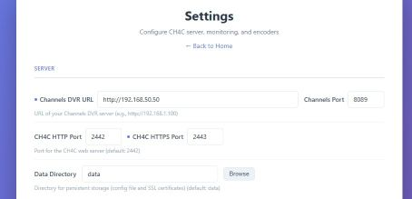
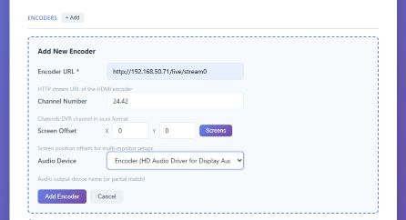
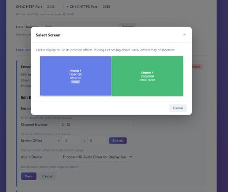
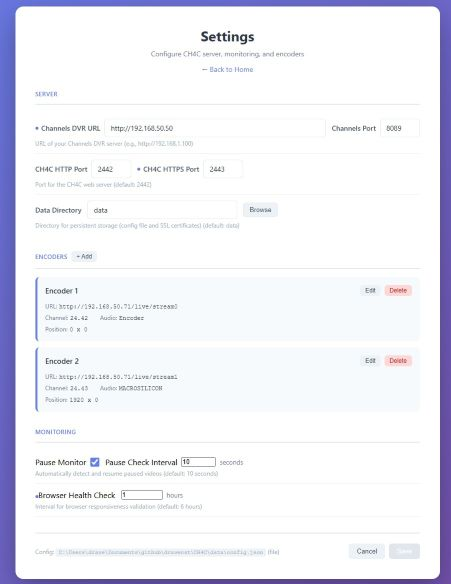

# Chrome HDMI for Channels (CH4C)

This project merges elements of the excellent [Chrome Capture for Channels](https://github.com/fancybits/chrome-capture-for-channels) and [HDMI for Channels](https://github.com/tmm1/androidhdmi-for-channels) projects, in an attempt to capture benefits of each. It builds on the original idea from [ParksideParade](https://github.com/ParksideParade/CH4C).

**Compared to similar projects:**
- **vs CC4C**: This project can run on a much lower cost/performance PC by offloading the video encoding of one or more streams to an external hardware HDMI encoder(s)
- **vs Android HDMI for Channels (AH4C)**: This project can capture from any web URL with no dependency on an Android TV app or device

**Why I made this:**

- Recovering channels lost from TV Everywhere (e.g., NFL Network)
- Recording web-only content (e.g., high school sports streaming websites without apps)
- Running on a low-cost PC (including Celeron-based machines running Channels DVR) with a relatively inexpensive external HDMI encoder like the Link Pi ENC1-V3 (~$120)

## Table of Contents

- [Requirements](#requirements)
- [Installation](#installation)
- [Getting Started](#getting-started)
- [Advanced Configuration](#advanced-configuration)
- [Web Interface](#web-interface)
  - [Home Page / Status Dashboard](#home-page--status-dashboard)
  - [Settings](#settings)
  - [M3U Manager](#m3u-manager)
  - [Instant Recording](#instant-recording)
  - [Remote Access](#remote-access)
- [Development](#development)
- [Performance Notes](#performance-notes)
- [License](#license)


---

## Requirements

### Hardware

- **Windows PC**: Most Windows PC should work, I run both my Channels DVR service and CH4C together on the same low power Intel Celeron 5105 PC.
- **Encoder**: Recommended [Link Pi ENC1-v3](https://a.co/d/76zJF9U) with dual input ports (HDMI and USB). For the USB port, use an HDMI to USB adapter.
- **VNC Server**: Recommended to install on the Windows PC for remote browser access and streaming service logins. Install [TightVNC](https://www.tightvnc.com/) (or similar) and enable **loopback connections** so CH4C's built-in VNC viewer can connect locally.

### Encoder Configuration

Follow the guidelines in the [Channels community thread](https://community.getchannels.com/t/linkpi-encoder-family/38860/4) to configure the encoders:

1. Connect your PC HDMI port(s) to the external encoder box
2. Set the encoder to 30fps 1920x1080 (to match the streaming services), and test CBR/VBR/AVBR and bitrate (minimum 8,000 recommended) to your preference.  The LinkPi ENC1-v3 USB 2.0 input only supports 30fps so set your encoder appropriately.
3. Set PC display(s) to 1920x1080 @ 60Hz.  Optionally, in Intel Graphics Command Center, set Quantization Range to "Full" for better black levels

See [example LinkPi encoder settings](./assets/linkpi-encoder-settings.jpg) for a recommended configuration.

---

## Installation

Download `ch4c.exe` from the latest [release](https://github.com/dravenst/CH4C/releases).

Alternatively, clone the repository and run from source:
```bash
git clone https://github.com/dravenst/CH4C
cd CH4C
npm install
node main.js --help
```

### Running CH4C at PC Startup

Install CH4C as a Windows scheduled task that starts automatically at user logon:

```bash
ch4c service install
```

This creates a scheduled task that runs CH4C when you log in, with a 30-second startup delay for system stabilization. The task itself runs without elevated privileges (required for Chrome).

> **Note**: The `install` and `uninstall` commands require **Administrator privileges**. Right-click Command Prompt and select "Run as administrator", or use PowerShell:
> ```powershell
> powershell -Command "Start-Process cmd -ArgumentList '/k cd /d C:\path\to\CH4C && ch4c service install' -Verb RunAs"
> ```

To use a custom data directory:

```bash
ch4c service install -d C:\ch4c-data
```

**Other service commands:**

```bash
ch4c service status      # Check if the task is installed and running
ch4c service start       # Start CH4C
ch4c service stop        # Stop CH4C gracefully
ch4c service uninstall   # Remove the scheduled task (requires Administrator)
```

For manual startup configurations using PowerShell scripts or batch files, see [ADVANCED_CONFIG.md](ADVANCED_CONFIG.md).

---

## Getting Started

> **Important**: Do NOT run ch4c.exe or display/sound config-related commands in a Windows Remote Desktop session. Video and audio sources will change when using Remote Desktop. Use VNC instead (e.g., [TightVNC](https://www.tightvnc.com/)). See [Remote Access](#remote-access) for the built-in VNC viewer.

CH4C is configured through its built-in **Settings** web interface. The home page includes a step-by-step Getting Started guide. Here is an overview of the setup process:

### Step 1: Preparation

Before starting CH4C:

1. Connect your HDMI encoder(s) to the PC
2. Set PC display(s) to **1920x1080** and configure the encoder transport stream to match (recommended **30fps**)
3. Install a VNC server (e.g., [TightVNC](https://www.tightvnc.com/)) and enable **loopback connections**

### Step 2: Configure Settings

Launch CH4C and navigate to `http://<CH4C_IP>:2442/settings`:

1. Enter your **Channels DVR URL** (e.g., `http://192.168.50.50`)
2. Optionally configure the **HTTPS port** for secure remote access (a self-signed SSL certificate is auto-generated, see [HTTPS_SETUP.md](HTTPS_SETUP.md))
3. Click **Save Settings**



### Step 3: Add Encoder(s)

In Settings, click **+ Add Encoder** for each HDMI encoder:

1. Set the **Encoder URL** (e.g., `http://192.168.50.71/live/stream0`)
2. Select the **Audio Device** from the dropdown — CH4C automatically discovers available audio devices and presents them for selection. Choose "Default" to use the system default audio device. If audio devices cannot be detected, a text field is shown instead where you can enter a partial device name (e.g., "Encoder" or "MACROSILICON").
3. For multi-monitor setups, set the **Screen X/Y Position** — use the **Screens** button to visually select a display, or the home page shows a Display Configuration visual with offsets for each monitor. Display scale must be set to 100% for correct positioning.
4. Click **Add Encoder**, then **Save Settings** and restart CH4C

| Add Encoder Form | Select Screen |
|:------------------:|:--------------:|
|  |  |

### Step 4: Add M3U Source to Channels DVR

1. In Channels DVR, go to Settings → Add Source → Custom Channels
2. Set Stream Format to **MPEG-TS**
3. Enter the M3U URL: `http://<CH4C_IP>:2442/m3u-manager/playlist.m3u`


### Step 5: Test the Encoder

1. Verify your encoder appears on the CH4C home page in the **Encoder Status** section with a healthy status
2. Try tuning to the encoder's channel in Channels DVR to confirm video and audio are working

### Step 6: Log In to Streaming Services

Use [Remote Access](#remote-access) (`http://<CH4C_IP>:2442/remote-access`) to connect to the PC via the built-in VNC viewer. Log in to each streaming service (NBC, Sling, Disney+, etc.) in the encoder browser windows. Credentials are cached per encoder, but services may periodically require re-authentication.


### Step 7: Add Channels

Use the [M3U Manager](#m3u-manager) (`http://<CH4C_IP>:2442/m3u-manager`) to build your channel lineup:

- **Refresh Sling TV** to automatically sync channels from the Sling TV guide
- **Add Custom Channel** for any streaming service URL (see [Sample Channel URLs](#sample-custom-channel-urls) below)

After adding channels, refresh the custom channel source in Channels DVR to pick up the new channels.

---

## Advanced Configuration

CH4C can also be configured via command-line parameters or a JSON configuration file for automated deployments or scripted setups. See [ADVANCED_CONFIG.md](ADVANCED_CONFIG.md) for details on CLI parameters, JSON configuration, display setup, and audio device setup.

---

## Web Interface

### Home Page / Status Dashboard

Navigate to `http://<CH4C_IP>:<CH4C_PORT>/` to view:
- Getting Started guide
- Encoder health and active streams
- Display configuration visual with screen offsets
- Available audio devices
- How CH4C Works overview


### Settings

Navigate to `http://<CH4C_IP>:<CH4C_PORT>/settings` to configure:
- Channels DVR server URL and port
- CH4C HTTP/HTTPS ports
- Add, edit, and remove encoders (URL, channel number, screen position, audio device)
- Data directory and monitoring options



### M3U Manager

Navigate to `http://<CH4C_IP>:<CH4C_PORT>/m3u-manager` to:
- Synchronize the channel guide from Sling TV (Favorites only recommended)
- Create custom channels for any streaming service with deep links
- Search for station IDs by callsign or channel name


**Refresh Sling TV to automatically sync channels from the Sling TV guide:**


**Add Custom Channel for any streaming service and look up the Station ID:**

| Add Custom Channel in M3U Manager | Station Lookup Option |
|:------------------:|:--------------:|
|  |  |

#### Sample Custom Channel URLs

| Channel | URL |
|---------|-----|
| ESPN | `https://www.espn.com/watch/player?network=espn` |
| ESPN2 | `https://www.espn.com/watch/player?network=espn2` |
| Disney | `https://disneynow.com/watch-live?brand=004` |
| Disney XD | `https://disneynow.com/watch-live?brand=009` |
| Disney Jr | `https://disneynow.com/watch-live?brand=008` |
| FX | `https://fxnow.fxnetworks.com/watch-live/93256af4-5e80-4558-aa2e-2bdfffa119a0` |
| FXX | `https://fxnow.fxnetworks.com/watch-live/49f4a471-8d36-4728-8457-ea65cbbc84ea` |
| FXM | `https://fxnow.fxnetworks.com/watch-live/d298ab7e-c6b1-4efa-ac6e-a52dceed92ee` |
| NGC | `https://www.nationalgeographic.com/tv/watch-live/0826a9a3-3384-4bb5-8841-91f01cb0e3a7` |
| NGC Wild | `https://www.nationalgeographic.com/tv/watch-live/239b9590-583f-4955-a499-22e9eefff9cf` |
| NBC KUSA | `https://www.nbc.com/live?brand=nbc&callsign=KUSA` |
| NBC News Now | `https://nbc.com/live?brand=nbc-news&callsign=nbcnews` |
| Bravo | `https://www.nbc.com/live?brand=bravo&callsign=BRAVOHD` |
| FreeForm | `https://abc.com/watch-live/885c669e-fa9a-4039-b42e-6c85c90cc86d` |

See [samples.m3u](./assets/samples.m3u) for additional examples including Sling TV, NBC.com, Spectrum, and Peacock ([Peacock link format](https://community.getchannels.com/t/adbtuner-a-channel-tuning-application-for-networked-google-tv-android-tv-devices/36822/1895)).

**Create a new Custom Channel in Channels DVR using the playlist.m3u URL found in your M3U Manager main screen:**


### Instant Recording

Navigate to `http://<CH4C_IP>:<CH4C_PORT>/instant` to:
- Instantly start recording any URL and it will automatically try to enable full screen video
- Tune your encoder to a URL without recording (watch in Channels on the encoder's channel number)
- Add your own show metadata that will be visible in the Channels DVR Recordings


### Remote Access

CH4C includes a built-in VNC viewer at `http://<CH4C_IP>:<CH4C_PORT>/remote-access` to connect to a VNC server running on your CH4C machine. This is used for logging in to streaming services in the encoder browsers.

For better clipboard functionality and security, enable HTTPS in [Settings](#settings). See [HTTPS_SETUP.md](HTTPS_SETUP.md) and [REMOTE_ACCESS_SETUP.md](REMOTE_ACCESS_SETUP.md) for details.


---

## Development

### Setup

```bash
winget install -e --id Git.Git
winget install -e --id OpenJS.NodeJS

git clone https://github.com/dravenst/CH4C
cd CH4C
npm install
node main.js --help
```

### Building

Build the Windows executable:
```bash
npm run build
```

---

## Performance Notes

This works surprisingly well, though streaming providers may have occasional glitches that prevent consistent loading.

**Additional notes:**
- **Mac and Linux**: This is optimized for Windows and is not currently configured to work on Mac or Linux.  I plan to add support in a future release.
- **HLS Support**: The examples use MPEG-TS, but HLS is also supported. Configure your encoder for HLS, update the Channels custom channel to use HLS, and adjust the encoder parameter to use the HLS stream URL
- **Secondary Channels DVR Server**: Channels allows you to export an M3U playlist from your primary Channels DVR server and import it into a secondary server to allow remote access for a second Channels DVR instance (e.g. if you only want to run a single CH4C instance and share with another device.). See the [Channels DVR Export Channels](https://getchannels.com/docs/channels-dvr-server/how-to/export-channels/) documentation for details on how to export and customize the M3U parameters. I highly recommend using Tailscale to create a private network to provide connectivity between your Channels DVR servers.

  Example M3U URL with customization parameters entered in Secondary Channels DVR as a new [Custom Channel](https://getchannels.com/docs/channels-dvr-server/how-to/custom-channels/) M3U Source:
  ```
  http://<TAILSCALE-CHANNELSDVR-IP>:8089/devices/<SOURCENAME>/channels.m3u?format=hls&bitrate=5000&codec=h264&acodec=copy
  ```

---

## License

This project is licensed under the [ISC License](LICENSE).
