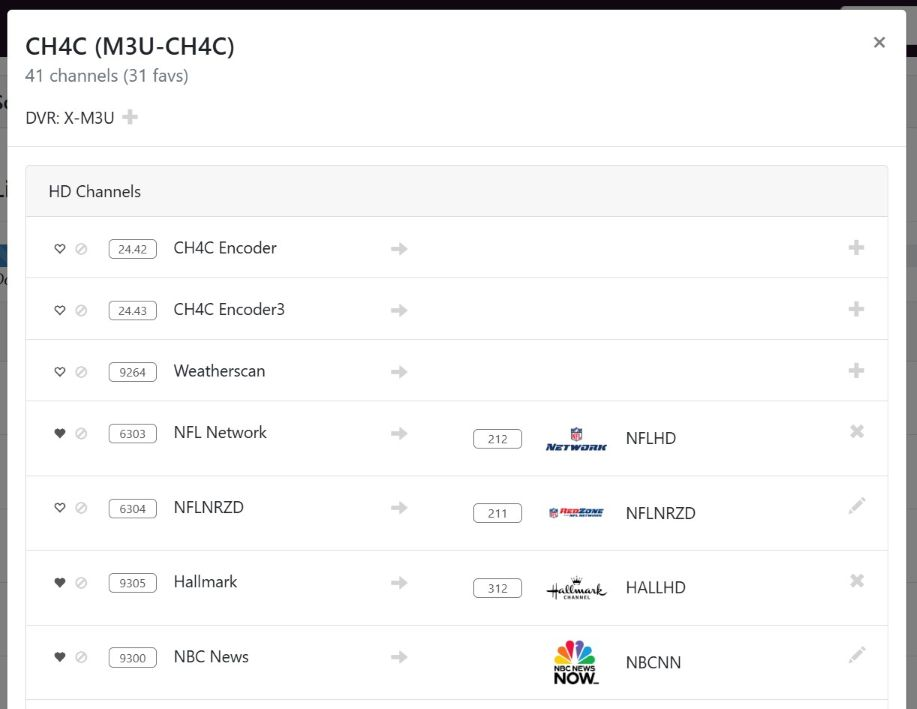
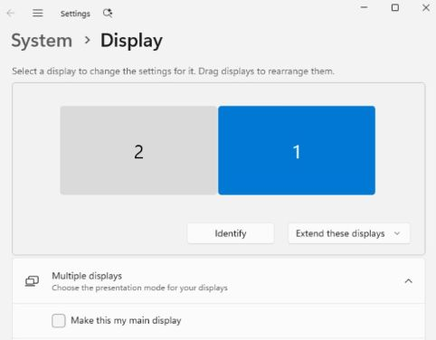
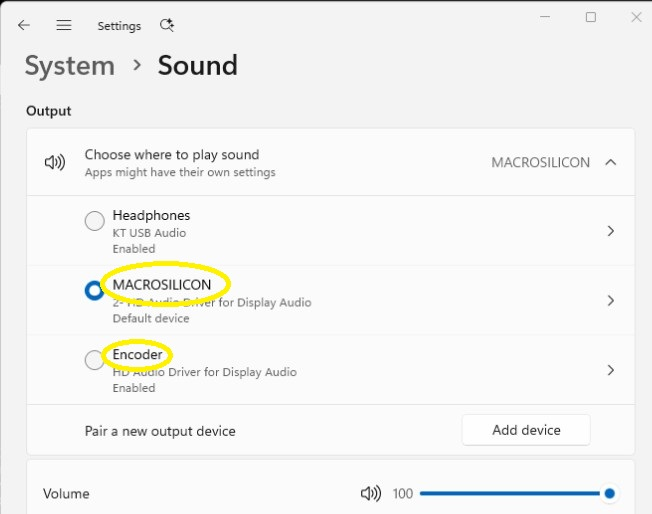
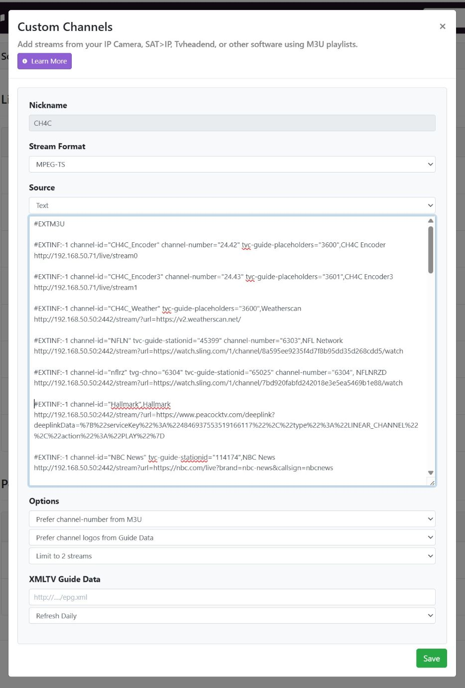

# Chrome HDMI for Channels (CH4C)

This project merges elements of the excellent [Chrome Capture for Channels](https://github.com/fancybits/chrome-capture-for-channels) and [HDMI for Channels](https://github.com/tmm1/androidhdmi-for-channels) projects, in an attempt to capture benefits of each.

Specifically:
* **vs CC4C**: this project can run on a lower performance PC by offloading the encoding of one or more streams to an external HDMI encoder(s)
* **vs HDMI for Channels**: this project can capture from any web URL with no dependency on the site having an Android TV app

### My favorite use cases / why I made this
* Recovering channels that I lost from TV Everywhere - for example NFL Network
* Recording content that is web-only - for example a high school sports streaming website that doesn't have an app
* Recording on-demand non-linear content - for example recording an NFL+ game replay
* Can be run on a low cost PC (e.g. the same PC where you're running Channels DVR) with a relatively low cost external encoder e.g. Link Pi ENC1-V3 ~$120




## Getting started

### Hardware required
* **Video source**: It's lightweight enough to run on your existing Channels box or a separate server.  (Windows exe available too.)
* **Encoder**: I used the [Link Pi ENC1-v3](https://a.co/d/76zJF9U) with dual input ports - both hdmi port and USB port - using an [HDMI to USB card like this for the second port](https://www.amazon.com/dp/B0C2MDTY8P?ref=ppx_yo2ov_dt_b_fed_asin_title)

### Config
* **Encoder**: I largely followed the guidelines [here](https://community.getchannels.com/t/linkpi-encoder-family/38860/4) to configure the encoders (setting 30 fps can help with performance and I also used the deinterlace feature).  Connect your PC HDMI port(s) to the external encoder box and confirm that you're able to see and hear on the encoder's streaming URL before you go any further using VLC or similar - see Stream menu and Play URL tab for links.  Make sure your PC config is set to 1920x1080 for the PC display(s).

* **Installation on Windows**:
Download the Windows exe `ch4c.exe` available in the latest [release](https://github.com/dravenst/CH4C/releases). You can create a ".ps1" file that can be used to run as a Windows startup task as outlined in the [chrome-capture thread](https://community.getchannels.com/t/chrome-capture-for-channels/36667/130) or summarized below. Or pull the source code locally and run `npm install` to install node packages if you're going to to run it via `node main.js`.  It uses the rebrowser-puppeteer-core package to help with bot detection for some sites.

* **DO NOT run in a Windows Remote Desktop session**: Video and audio sources change when running with Windows Remote Desktop aka Windows App.  For remote access, use VNC instead (e.g. [TightVNC server](https://www.tightvnc.com/) or similar.)

* **First Run - configure video sources**: on first startup, you will have to manually complete any one-time logins for the sites triggered by CH4C. Each browser instance uses it's own user directory, and will be created at startup so you can get to the appropriate websites.  You can run via the node command or ch4c.exe to make this happen.  There were will be one browser instance per encoder created at startup and pooled for faster streaming.

* **Run parameters**: 
It's required to pass in at least --channels-url and --encoder for your setup (see example below).  You can specify more than one encoder if you have multiple hdmi outputs available. 
e.g.
```
Usage: node main.js [options]

Options:
  -s, --channels-url   Channels server URL  [string] [required]
  -p, --channels-port  Channels server port  [string] [default: "8089"]
  -e, --encoder        Encoder configurations in format "url[:channel:width_pos:height_pos:audio_device]" where channel is optional (format: xx.xx, default: 24.42), width_pos/height_pos are optional screen positions (default: 0:0), and audio_device is the optional audio output device name  [array] [required]
  -c, --ch4c-port      CH4C port number  [number] [default: 2442]
  -h, --help           Show help  [boolean]

Examples:
  > main.js -s "http://192.168.50.50" -e "http://192.168.50.71/live/stream0"

  Simple example with channels server at 192.168.50.50 and single encoder at 192.168.50.71.
  

  > main.js -s "http://192.168.50.50" -e "http://192.168.50.71/live/stream0:24.42:0:0:Encoder" -e "http://192.168.50.72/live/stream1:24.43:1921:0:MACROSILICON"

  This sets the channels server to 192.168.50.50 and encoder to 192.168.50.71/live/stream0 and a second encoder at stream1. The 1921 position of stream1 moves it to the right on startup on screen 2 in a dual monitor setup.

  When specifying more than one encoder, you will need to find the audio device Name and specify the first portion of it at the end of the encoder param.  In Windows, to see encoder audio device names, look in Windows Sound Settings or use the powershell command: Get-AudioDevice -List
```

* **Encoder Width and Height Position**: The position values are dependent on your display setup. In Windows, I configured my two encoder HDMI displays to align at the bottom and both are setup as 1920x1080.  Therefore, one display will be setup with width and height position as 0:0 and the other that is offset to the right by the width of the first display will be 1921:0.



* **Audio Setup**: Audio setup is tricky in a multi-encoder environment. You need to first identify the appropriate device names (e.g. look under Sound devices in Windows - sample below) or use the Powershell command below in Windows `Get-AudioDevice -List`).  Then use the first portion of the Name field for the Encoder parameter.  For multiple encoders, you'll have to do some trial and error to find the right audio device to match with the appropriate encoder stream url.  If not specified, CH4C will use the default audio device on the platform.  If no match, it will display the available active audio devices in the console.  You can also query the uri /audio-devices to see a full list of audio devices available on the PC when CH4C is running.

Here's an example Windows Sound Settings showing the two audio devices available for the Link Pi ENC1-V3 hardware encoder



```
Below is an alternative Powershell command to get a list of audio output devices in Windows.  Note that the Name field contains the device name we're looking for.  My audio devices for the Link Pi were labeled "Encoder" and "MACROSILICON" in the example below, but yours will likely be different.  For multiple encoders, you'll need to test to see which audio device Name maps to the appropriate Encoder stream through trial and error.

PS C:\> Get-AudioDevice -List

Index                : 1
Default              : True
DefaultCommunication : False
Type                 : Playback
Name                 : Encoder (4- HD Audio Driver for Display Audio)
ID                   : {0.0.0.00000000}.{0a55cb4b-1124-4bd8-bc79-ce7f3ef5df1e}
Device               : CoreAudioApi.MMDevice

Index                : 2
Default              : False
DefaultCommunication : True
Type                 : Playback
Name                 : Headphones (KT USB Audio)
ID                   : {0.0.0.00000000}.{8d1ce611-6cf0-4739-b065-be7bdba9bc60}
Device               : CoreAudioApi.MMDevice

Index                : 3
Default              : False
DefaultCommunication : False
Type                 : Playback
Name                 : MACROSILICON (3- HD Audio Driver for Display Audio)
ID                   : {0.0.0.00000000}.{a14f146f-a40c-41fe-827e-f4f4e6ed3d00}
Device               : CoreAudioApi.MMDevice

```

* **Windows Startup using Windows Task Scheduler**:
  * **Windows Startup Configuration**:
Create a new text file called `ch4c.ps1` and add the following line to it (replacing `(YOUR-PATH)` with your path to where you stored the .exe file, and replacing the IP of the channels url and encoder stream url with your config):
`Start-Process -WindowStyle hidden -FilePath "(YOUR-PATH)\ch4c.exe" -ArgumentList "--channels-url", "http://192.168.50.50", "--encoder", "http://192.168.50.71/live/stream0"`

  * **Windows Startup Configuration #2**:
Or a more complex example for the `ch4c.ps1` file using both encoder ports of the ENC1-V3:
`Start-Process -WindowStyle hidden -FilePath "(YOUR-PATH)\ch4c.exe" -ArgumentList "--channels-url", "http://192.168.50.50", "--encoder", "http://192.168.50.71/live/stream0:24.42:0:0:Encoder" "--encoder", "http://192.168.50.72/live/stream1:24.43:1921:0:MACROSILICON"`

  * **Create Windows Task Scheduler Task**:
Create a new task to run the `ch4c.ps1` file in Windows Task Scheduler, leave "Run with highest privileges" UNCHECKED (the latest Chrome browser security settings don't like this), and set it to trigger it when the user logs on (it's critical to run after user login to enable the GPU). Run the new Windows task you created manually to test it and be sure to visit all of the streaming sites within the browser that pops up after you try to stream your first channel.  This will allow you to login to the sites and retain the credentials for later runs. 

* **Channels DVR custom channel**: create a custom channel in the Channels DVR Settings->Sources following the example below. Be sure to set the Stream Format to `MPEG-TS`. If it's a linear channel like NFL Network you can also map the channel so you get guide data. See the [samples.m3u](./assets/samples.m3u)file for more examples for Sling TV. CH4C also supports Spectrum and Peacocktv.com [(see how to do peacock links)](https://community.getchannels.com/t/adbtuner-a-channel-tuning-application-for-networked-google-tv-android-tv-devices/36822/1895).  Please note that in the example below that 192.168.50.71 is the IP address of the Link Pi encoder and 192.168.50.50 is the IP address where CH4C is running.



### Using
CH4C can be used in several ways:
* **Streaming channels**: supports nbc channels, NFL Network, Disney, Sling TV, Google Photos, and others available via web
* **Custom channel**: using the custom channels that you created in Channels, simply use Channels to tune and record as you always would
* **Instant**: go to <CH4C_IP_ADDRESS>:<CH4C_PORT>/instant and you should see a simple UI to instantly start recording any given URL. Or you can just "tune" your dedicated encoder channel to that URL, so you can then watch in Channels on channel number 24.42

### Developing
windows
```
winget install -e --id Git.Git
winget install -e --id OpenJS.NodeJS

git clone https://github.com/dravenst/CH4C
cd CH4C
npm install
node main.js --help
```

Build the ch4c.exe executable for Windows
```
npm run build
```

## Results

### Performance
This works surprisingly well for me, but the streaming providers can have some glitches that prevent consistent loading of screens.

* **Health Status**: Basic Health status is available at http://<YOUR CH4C IP>:<YOUR CH4C PORT>/health
* **Audio Devices**: Audio Device list detected by CH4C available at http://<YOUR CH4C IP>:<YOUR CH4C PORT>/audio-devices

### Likely Failures / Things I Haven't Tested
* **Mac and Docker**: This is optimized for Windows, so it's not likely to work well on Mac of Docker yet
* **NBC sites on Linux problem**: unfortunately on my Pi5 the NBC sites do not load in Chromium. Even when I just open Chromium as a normal user, the video doesn't play and I get some Widevine DRM related error. Hopefully you'll have more luck on a Win/Mac, and if you are able to load NBC sites on a Pi please let me know how to do it!
