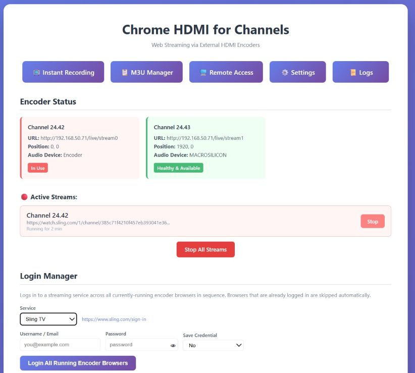
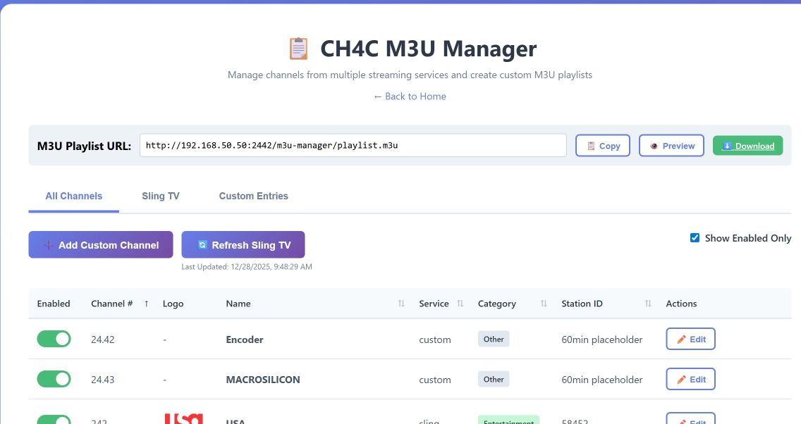
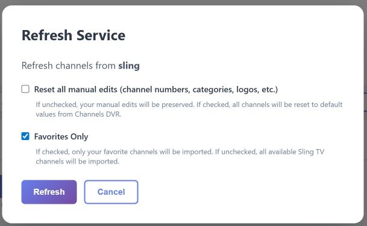
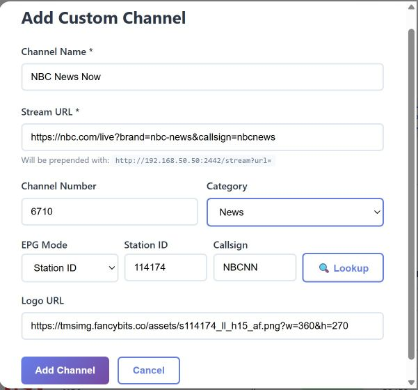
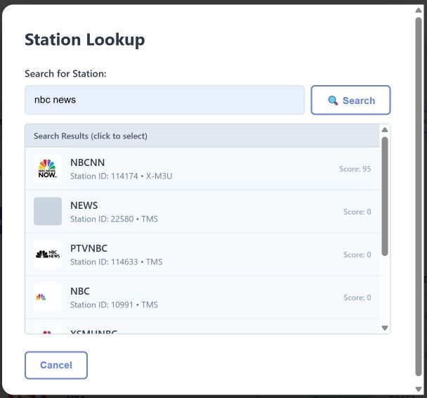
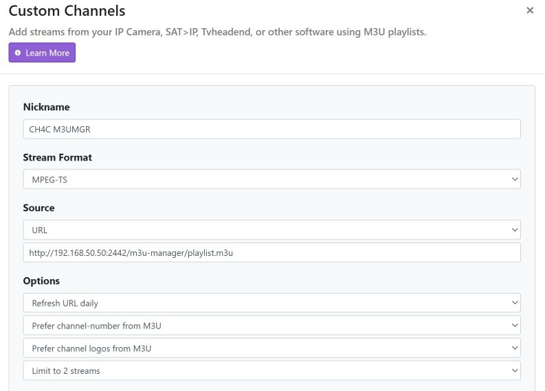
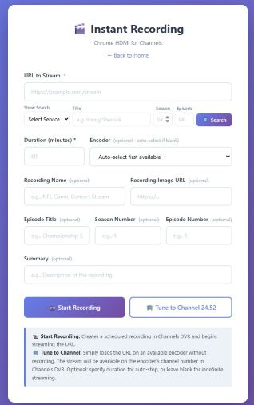
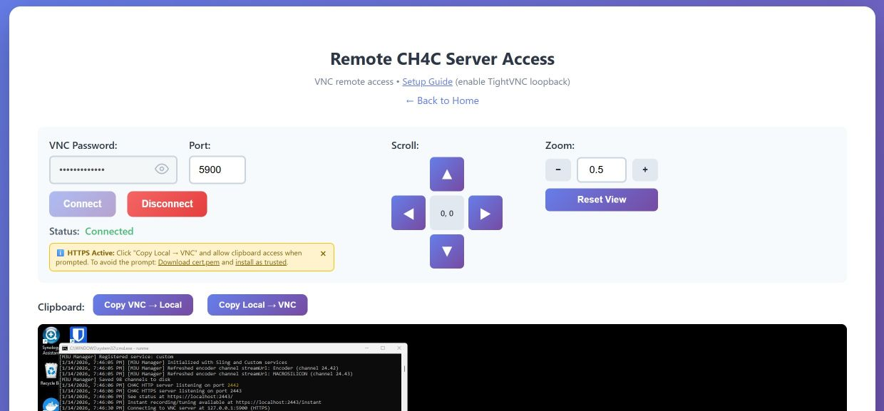

# Chrome HDMI for Channels (CH4C)

This project merges elements of the excellent [Chrome Capture for Channels](https://github.com/fancybits/chrome-capture-for-channels) and [HDMI for Channels](https://github.com/tmm1/androidhdmi-for-channels) projects, in an attempt to capture benefits of each. It builds on the original idea from [ParksideParade](https://github.com/ParksideParade/CH4C).

**Compared to similar projects:**
- **vs CC4C**: This project can run on a much lower cost/performance PC by offloading the video encoding of one or more streams to an external hardware HDMI encoder(s)
- **vs Android HDMI for Channels (AH4C)**: This project can capture from any web URL with no dependency on an Android TV app or device

**Why I made this:**

- Recovering channels lost from TV Everywhere (e.g., NFL Network)
- Recording web-only content (e.g., high school sports streaming websites without apps)
- Running on a low-cost PC (including Celeron-based machines running Channels DVR) with a relatively inexpensive external HDMI encoder like the Link Pi ENC1-V3 (~$120)

## Table of Contents

- [Requirements](#requirements)
- [Installation](#installation)
- [Configuration](#configuration)
  - [Command-Line Parameters](#command-line-parameters)
  - [JSON Configuration File](#json-configuration-file)
  - [Encoder Display Setup](#encoder-display-setup)
  - [Audio Device Setup](#audio-device-setup)
- [First Run Setup](#first-run-setup)
- [Running CH4C](#running-ch4c)
  - [Windows Task Scheduler (Auto-Start)](#windows-task-scheduler-auto-start)
- [Web Interface](#web-interface)
  - [Status Dashboard](#status-dashboard)
  - [M3U Manager](#m3u-manager)
  - [Instant Recording](#instant-recording)
  - [Remote Access](#remote-access)
- [Channels DVR Integration](#channels-dvr-integration)
- [Development](#development)
- [Performance Notes](#performance-notes)
- [License](#license)


---

## Requirements

### Hardware

- **Windows PC**: Most Windows PC should work, I run both my Channels DVR service and CH4C together on the same low power Intel Celeron 5105 PC.
- **Encoder**: Recommended [Link Pi ENC1-v3](https://a.co/d/76zJF9U) with dual input ports (HDMI and USB). For the USB port, use an HDMI to USB adapter.  The LinkPi ENC1-v3 USB ports are only USB 2.0 so it will only effectively support 1920x1080p @30 fps on this second input (or it might show some periodic screen tearing).

### Encoder Configuration

Follow the guidelines in the [Channels community thread](https://community.getchannels.com/t/linkpi-encoder-family/38860/4) to configure the encoders:

1. Connect your PC HDMI port(s) to the external encoder box
2. I recommend setting encoder to 30fps 1920x1080 (to match the streaming services), and test CBR/VBR/AVBR and bitrate (minimum 8,000 recommended) to your preference.  Reminder that the LinkPi ENC1-v3 USB input only supports 30fps so set your encoder appropriately.
3. Set PC display(s) to 1920x1080 @ 60Hz.  Optionally, in Intel Graphics Command Center, set Quantization Range to "Full" for better black levels

---

## Installation

Download `ch4c.exe` from the latest [release](https://github.com/dravenst/CH4C/releases).

Alternatively, clone the repository and run from source:
```bash
git clone https://github.com/dravenst/CH4C
cd CH4C
npm install
node main.js --help
```

## Configuration

CH4C can be configured via command-line parameters or a JSON configuration file. If both exist, command-line parameters take precedence.

### Command-Line Parameters

```
Usage: node main.js [options]

Required:
  -s, --channels-url              Channels server URL                    [string] [required]
  -e, --encoder                   Encoder config (see format below)      [array] [required]

Optional:
  -p, --channels-port             Channels server port                   [default: "8089"]
  -c, --ch4c-port                 CH4C port number                       [default: 2442]
  -t, --ch4c-ssl-port             Enable HTTPS on specified port
  -n, --ssl-hostnames             Additional hostnames/IPs for SSL cert (comma-separated)
  -d, --data-dir                  Directory for storing channel data     [default: "data"]
  -m, --enable-pause-monitor      Enable video pause detection/resume    [default: true]
  -i, --pause-monitor-interval    Pause check interval in seconds        [default: 10]
  -b, --browser-health-interval   Browser health check interval (hours)  [default: 6]
  -h, --help                      Show help
```

**Encoder format**: `url[:channel:width_pos:height_pos:audio_device]`
- `url` - Encoder stream URL (required)
- `channel` - Channel number in xx.xx format (default: 24.42)
- `width_pos` - Screen X position offset (default: 0)
- `height_pos` - Screen Y position offset (default: 0)
- `audio_device` - Audio output device name (optional)

#### Examples

> **Important**: Do NOT run ch4c.exe or display/sound config-related commands in a Windows Remote Desktop session. Video and audio sources will change when using Remote Desktop. Use VNC instead (e.g., [TightVNC](https://www.tightvnc.com/)). See [Remote Access](#remote-access) for the built-in VNC viewer.

---

**Simple single encoder:**
```bash
node main.js -s "http://192.168.50.50" -e "http://192.168.50.71/live/stream0"
```

**Dual encoders with audio devices:**
```bash
node main.js -s "http://192.168.50.50" \
  -e "http://192.168.50.71/live/stream0:24.42:0:0:Encoder" \
  -e "http://192.168.50.71/live/stream1:24.43:1920:0:MACROSILICON"
```
The `1920` position moves stream1 to the second monitor in a dual-monitor setup.

**With HTTPS enabled:**
```bash
node main.js -s "http://192.168.50.50" -e "http://192.168.50.71/live/stream0" -t 2443
```
A self-signed SSL certificate is auto-generated on first run. See [HTTPS_SETUP.md](HTTPS_SETUP.md) for certificate installation.

### JSON Configuration File

Create `data/config.json` for complex setups:

```json
{
  "channelsUrl": "http://192.168.50.50",
  "channelsPort": "8089",
  "ch4cPort": 2442,
  "ch4cSslPort": 2443,
  "sslHostnames": [],
  "dataDir": ".\\data",
  "enablePauseMonitor": true,
  "pauseMonitorInterval": 10,
  "browserHealthInterval": 6,
  "encoders": [
    {
      "url": "http://192.168.50.185/live/stream0",
      "channel": "24.52",
      "width": 0,
      "height": 0,
      "audioDevice": "Encoder"
    },
    {
      "url": "http://192.168.50.185/live/stream1",
      "channel": "24.53",
      "width": 1920,
      "height": 0,
      "audioDevice": "HDMI TO USB"
    }
  ]
}
```

| JSON Property | CLI Equivalent | Description |
|---------------|----------------|-------------|
| `channelsUrl` | `-s` | Channels server URL |
| `channelsPort` | `-p` | Channels server port (default: 8089) |
| `ch4cPort` | `-c` | CH4C HTTP port (default: 2442) |
| `ch4cSslPort` | `-t` | CH4C HTTPS port (optional) |
| `sslHostnames` | `-n` | Additional SSL hostnames/IPs |
| `dataDir` | `-d` | Data directory location |
| `enablePauseMonitor` | `-m` | Enable pause detection (default: true) |
| `pauseMonitorInterval` | `-i` | Pause check interval in seconds |
| `browserHealthInterval` | `-b` | Browser health check interval in hours |
| `encoders` | `-e` | Array of encoder configurations |

**Encoder object properties:**

| Property | Description |
|----------|-------------|
| `url` | Encoder stream URL (required) |
| `channel` | Channel number in xx.xx format (default: 24.42) |
| `width` | Screen X position offset (default: 0) |
| `height` | Screen Y position offset (default: 0) |
| `audioDevice` | Audio output device name |

### Encoder Display Setup

Position values depend on your display setup. For two 1920x1080 displays aligned at the bottom:
- First display: `width: 0, height: 0`
- Second display (offset to the right): `width: 1920, height: 0`

> **Note**: Display scale must be set to 100% for correct positioning.

**PowerShell command to find display offsets:**
```powershell
Add-Type -AssemblyName System.Windows.Forms; [System.Windows.Forms.Screen]::AllScreens | Select-Object DeviceName, Primary, Bounds
```


### Audio Device Setup

For multi-encoder setups, you must identify and specify audio device names.

**Finding audio devices in Windows:**

1. Check Windows Sound Settings, or
2. Use PowerShell: `Get-AudioDevice -List`

Use the first portion of the device Name field for the encoder parameter. If not specified, CH4C uses the default audio device. Query `/audio-devices` endpoint to see available devices when CH4C is running.


**Example PowerShell output:**
```
PS C:\> Get-AudioDevice -List

Index                : 1
Default              : True
DefaultCommunication : False
Type                 : Playback
Name                 : Encoder (4- HD Audio Driver for Display Audio)
ID                   : {0.0.0.00000000}.{0a55cb4b-1124-4bd8-bc79-ce7f3ef5df1e}
Device               : CoreAudioApi.MMDevice

Index                : 2
Default              : False
DefaultCommunication : True
Type                 : Playback
Name                 : Headphones (KT USB Audio)
ID                   : {0.0.0.00000000}.{8d1ce611-6cf0-4739-b065-be7bdba9bc60}
Device               : CoreAudioApi.MMDevice

Index                : 3
Default              : False
DefaultCommunication : False
Type                 : Playback
Name                 : MACROSILICON (3- HD Audio Driver for Display Audio)
ID                   : {0.0.0.00000000}.{a14f146f-a40c-41fe-827e-f4f4e6ed3d00}
Device               : CoreAudioApi.MMDevice
```

In this example, the audio devices are "Encoder" and "MACROSILICON". For multiple encoders, trial and error may be needed to match audio devices to the correct encoder streams.

---

## First Run Setup

> **Important**: Do NOT run ch4c.exe or display/sound config-related commands in a Windows Remote Desktop session. Video and audio sources will change when using Remote Desktop. Use VNC instead (e.g., [TightVNC](https://www.tightvnc.com/)). See [Remote Access](#remote-access) for the built-in VNC viewer.

---

On the first startup, you need to complete the one-time logins in each encoder browser for all of the streaming sites you plan to use to ensure the credentials are now cached within each encoder browser going forward.  Periodically, the streaming sites may ask you to reauthenticate again.  To complete this, it's easiest if you temporarily adjust the browser positions for the encoder to display in the main screen.  In your startup config,  set the `width_pos` and `height_pos` offsets to your main screen e.g. `0:0` so that browser windows appear on your main screen for easy logins.

---

## Running CH4C at PC Startup

### Windows Task Scheduler (Auto-Start) with a powershell `ch4c.ps1` file

**Option 1: Using config.json**

Create `ch4c.ps1` with simple ch4c.exe command line assuming config.json located in `WorkingDirectory` .\data directory:
```powershell
Start-Process -WindowStyle Minimized -FilePath "cmd.exe" -ArgumentList "/k", "(YOUR-PATH)\ch4c.exe" -WorkingDirectory "(YOUR-ROOT-PATH)"
```

**Option 2: Command-line arguments**

Create `ch4c.ps1` with ch4c.exe command line parameters:
```powershell
Start-Process -WindowStyle hidden -FilePath "(YOUR-PATH)\ch4c.exe" -ArgumentList "-t", "2443", "--channels-url", "http://192.168.50.50", "--encoder", "http://192.168.50.71/live/stream0:24.42:0:0:Encoder", "--encoder", "http://192.168.50.72/live/stream1:24.43:1920:0:MACROSILICON"
```

**Option 3: Using a batch file e.g. runme.bat (Simplest)**

Create `ch4c.ps1` calling the `runme.bat` file:
```powershell
Start-Process -WindowStyle hidden -FilePath "(YOUR-PATH)\runme.bat"
```

Sample `runme.bat` with logging:
```batch
cd (YOUR-PATH)

@echo ***Waiting 30 seconds for system to stabilize on startup...
timeout /t 30

@echo ***Running ch4c and capture logs in .\data\ch4c.log
powershell -Command "ch4c.exe 2>&1 | Tee-Object -FilePath .\data\ch4c.log -Append"
```

**Creating the Task Scheduler task:**

1. Create a new task to run `ch4c.ps1`
2. Leave "Run with highest privileges" **UNCHECKED** (Chrome security doesn't like the browser running with highest privileges)
3. Set trigger to "When the user logs on" (required to ensure browser has GPU access)
4. Run the new task manually to test

---

## Web Interface

### Status Dashboard

Navigate to `http://<CH4C_IP>:<CH4C_PORT>/` to view:
- Encoder health
- Audio devices
- Command-line reference
- M3U configuration examples



### M3U Manager

Navigate to `http://<CH4C_IP>:<CH4C_PORT>/m3u-manager` to:
- Synchronize the channel guide from Sling TV (Favorites only recommended)
- Create custom channels for any streaming service with deep links
- Search for station IDs by callsign or channel name

**Channels DVR Setup:**
1. Add a new source in Channels DVR Settings
2. Set Stream Format to `MPEG-TS`
3. Set Source URL to `http://<CH4C_IP>:<CH4C_PORT>/m3u-manager/playlist.m3u`

**Navigate to your CH4C IP in a browser and select M3U Manager to view the M3U Manager main screen**



**Selecting Refresh Sling TV will enable you synch the channels automatically from the Sling TV guide**



**Selecting the Add Custom Channel from the M3U Manager main screen enables you to add any type of channel for any service and Lookup the Station ID**

| Add Custom Channel in M3U Manager | Station Lookup Option |
|:------------------:|:--------------:|
|  |  |

**Sample Custom Channel URLs:**

| Channel | URL |
|---------|-----|
| ESPN | `https://www.espn.com/watch/player?network=espn` |
| ESPN2 | `https://www.espn.com/watch/player?network=espn2` |
| Disney | `https://disneynow.com/watch-live?brand=004` |
| Disney XD | `https://disneynow.com/watch-live?brand=009` |
| Disney Jr | `https://disneynow.com/watch-live?brand=008` |
| FX | `https://fxnow.fxnetworks.com/watch-live/93256af4-5e80-4558-aa2e-2bdfffa119a0` |
| FXX | `https://fxnow.fxnetworks.com/watch-live/49f4a471-8d36-4728-8457-ea65cbbc84ea` |
| FXM | `https://fxnow.fxnetworks.com/watch-live/d298ab7e-c6b1-4efa-ac6e-a52dceed92ee` |
| NGC | `https://www.nationalgeographic.com/tv/watch-live/0826a9a3-3384-4bb5-8841-91f01cb0e3a7` |
| NGC Wild | `https://www.nationalgeographic.com/tv/watch-live/239b9590-583f-4955-a499-22e9eefff9cf` |
| NBC KUSA | `https://www.nbc.com/live?brand=nbc&callsign=KUSA` |
| NBC News Now | `https://nbc.com/live?brand=nbc-news&callsign=nbcnews` |
| Bravo | `https://www.nbc.com/live?brand=bravo&callsign=BRAVOHD` |
| FreeForm | `https://abc.com/watch-live/885c669e-fa9a-4039-b42e-6c85c90cc86d` |

**Create a new Custom Channel in Channels DVR admin tool using the playlist.m3u URL found in your M3U Manager main screen:**



### Instant Recording

Navigate to `http://<CH4C_IP>:<CH4C_PORT>/instant` to:
- Instantly start recording any URL and it will automatically try to enable full screen video
- Tune your encoder to a URL without recording (watch in Channels on the encoder's channel number)
- Enables you to add your own show metadata that will be visible in the Channels DVR Recordings



### Remote Access

CH4C includes a built-in VNC viewer at `http://<CH4C_IP>:<CH4C_PORT>/remote-access` to connect to a VNC server running on your CH4C machine.

For better clipboard functionality and security, to avoid browser security warnings, enable HTTPS using the `-t` parameter. See [HTTPS_SETUP.md](HTTPS_SETUP.md) and [REMOTE_ACCESS_SETUP.md](REMOTE_ACCESS_SETUP.md) for details.



---

## ALTERNATIVE Channels DVR Integration

If you choose not to use the M3U Manager method above to configure new channels for the Channels DVR Integration, you can still manually create a custom channel in the Channels DVR admin tool:

1. Go to Channels DVR Settings → Sources
2. Add a new custom channel
3. Set Stream Format to `MPEG-TS`
4. Add channel entries using the proper format noticed in the samples below
4. For linear channels (e.g., NFL Network), map the channel for guide data if needed

See [samples.m3u](./assets/samples.m3u) for examples including Sling TV, NBC.com, Spectrum, and Peacock ([Peacock link format](https://community.getchannels.com/t/adbtuner-a-channel-tuning-application-for-networked-google-tv-android-tv-devices/36822/1895)).

> **Note**: In the example below, 192.168.50.71 is the encoder IP and 192.168.50.50 is the CH4C server IP.


---

## Development

### Setup

```bash
winget install -e --id Git.Git
winget install -e --id OpenJS.NodeJS

git clone https://github.com/dravenst/CH4C
cd CH4C
npm install
node main.js --help
```

### Building

Build the Windows executable:
```bash
npm run build
```

---

## Performance Notes

This works surprisingly well, though streaming providers may have occasional glitches that prevent consistent loading.

**Additional notes:**
- **Mac and Linux**: This is optimized for Windows and is not likely to work on Mac or Linux
- **HLS Support**: The examples use MPEG-TS, but HLS is also supported. Configure your encoder for HLS, update the Channels custom channel to use HLS, and adjust the encoder parameter to use the HLS stream URL
- **Secondary Channels DVR Server**: Channels allows you to export an M3U playlist from your primary Channels DVR server and import it into a secondary server to allow remote access for a second Channels DVR instance (e.g. if you only want to run a single CH4C instance and share with another device.). See the [Channels DVR Export Channels](https://getchannels.com/docs/channels-dvr-server/how-to/export-channels/) documentation for details on how to export and customize the M3U parameters. I highly recommend using Tailscale to create a private network to provide connectivity between your Channels DVR servers.

  Example M3U URL with customization parameters entered in Secondary Channels DVR as a new Custom Channel M3U Source:
  ```
  http://<TAILSCALE-CHANNELSDVR-IP>:8089/devices/<SOURCENAME>/channels.m3u?format=hls&bitrate=5000&codec=h264&acodec=copy
  ```

---

## License

This project is licensed under the [ISC License](LICENSE).
